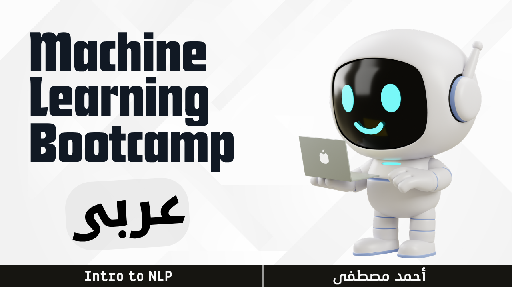

# MLB12 — Intro to NLP

  

> **PDFs:** [NLP with Deep Learning](PDFs/NLP%20with%20Deep%20Learning.pdf) | [RNN & LSTM](PDFs/RNN%20%26%20LSTM.pdf)

| # | Topic | Duration | YouTube | PDF | CODE |
|---|-------|----------|---------|-----|------|
| 01 | What is NLP | `3:21` | [Link](https://www.youtube.com/watch?v=FL1QlZBjdk4) | [PDF](PDFs/NLP%20with%20Deep%20Learning.pdf) | - |
| 02 | Sequence Models | `5:53` | [Link](https://www.youtube.com/watch?v=dIymW5toC_8) | [PDF](PDFs/NLP%20with%20Deep%20Learning.pdf) | - |
| 03 | NLP Applications | `2:05` | [Link](https://www.youtube.com/watch?v=9kFOR02dgw8) | [PDF](PDFs/NLP%20with%20Deep%20Learning.pdf) | - |
| 04 | Classic vs Modern NLP | `1:30` | [Link](https://www.youtube.com/watch?v=SdYCNZIAqqA) | [PDF](PDFs/NLP%20with%20Deep%20Learning.pdf) | - |
| 05 | Text Cleaning 01 | `7:28` | [Link](https://www.youtube.com/watch?v=UOkGl_nutj0) | - | [Notebook](CODE/Text%20Cleaning%20and%20Processing.ipynb) |
| 06 | Text Cleaning 02 | `8:00` | [Link](https://www.youtube.com/watch?v=GgRDt7tNQpU) | - | [Notebook](CODE/Text%20Cleaning%20and%20Processing.ipynb) |
| 07 | Bag of Words 01 | `6:45` | [Link](https://www.youtube.com/watch?v=jqxZSN1il7E) | - | [Notebook](CODE/Text%20Cleaning%20and%20Processing.ipynb) |
| 08 | Bag of Words 02 | `8:58` | [Link](https://www.youtube.com/watch?v=K-2xfG2KL9s) | - | [Notebook](CODE/Text%20Cleaning%20and%20Processing.ipynb) |
| 09 | Word Embedding Intro | `3:19` | [Link](https://www.youtube.com/watch?v=Ig32SN-1Q7s) | [PDF](PDFs/NLP%20with%20Deep%20Learning.pdf) | - |
| 10 | Word2vec | `5:46` | [Link](https://www.youtube.com/watch?v=6GNEM5YNteg) | [PDF](PDFs/NLP%20with%20Deep%20Learning.pdf) | - |
| 11 | Embedding Layer | `4:29` | [Link](https://www.youtube.com/watch?v=qFnroHipRoE) | [PDF](PDFs/NLP%20with%20Deep%20Learning.pdf) | - |
| 12 | Sentiment Analysis Log Reg | `8:07` | [Link](https://www.youtube.com/watch?v=aif8Cx6k8Gk) | [PDF](PDFs/NLP%20with%20Deep%20Learning.pdf) | [Notebook](CODE/Tweets%20Sentiment%20Analysis_LogReg.ipynb) |
| 13 | Sentiment Analysis ANN | `8:01` | [Link](https://www.youtube.com/watch?v=7IPlJU6ax3c) | [PDF](PDFs/NLP%20with%20Deep%20Learning.pdf) | [Notebook](CODE/Tweets%20Sentiment%20Analysis_ANN.ipynb) |
| 14 | Recurrent Neural Network | `10:17` | [Link](https://www.youtube.com/watch?v=yowKXCZywYs) | [PDF](PDFs/RNN%20%26%20LSTM.pdf) | [Notebook](CODE/Tweets%20Sentiment%20Analysis_RNN.ipynb) |
| 15 | Long Short Term Memory | `11:00` | [Link](https://www.youtube.com/watch?v=UTay0LobsVw) | [PDF](PDFs/RNN%20%26%20LSTM.pdf) | - |
| 16 | RNN | `12:45` | [Link](https://www.youtube.com/watch?v=m5xU5N2tlyU) | [PDF](PDFs/RNN%20%26%20LSTM.pdf) | - |
| 17 | LSTM | `7:19` | [Link](https://www.youtube.com/watch?v=M8VqtX70YAg) | [PDF](PDFs/RNN%20%26%20LSTM.pdf) | - |

**Total:** `2:14:43`
