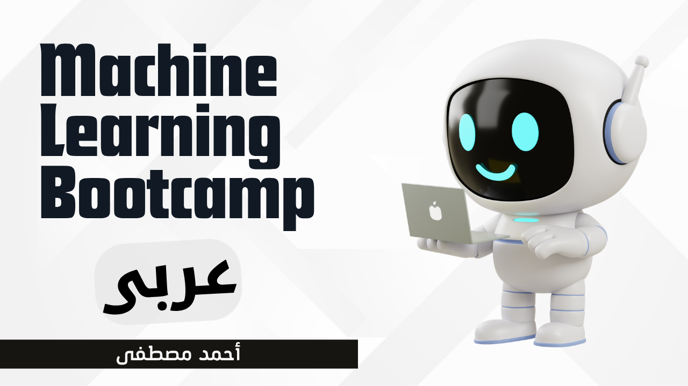

# Arabic ML Bootcamp

  

A structured machine learning bootcamp covering AI fundamentals, Python, data analysis, and machine learning.

## Prerequisites

- Laptop with internet connection
- No prior Programming or Data Experience required

## Modules

| # | Module | Topics | Playlist |
|---|--------|--------|----------|
| 01 | [Intro to AI & Data Science](01-intro_to_ai_and_data_science/) | AI basics, ML concepts, data science lifecycle | [YouTube](https://www.youtube.com/playlist?list=PLCYrpkpZ-B_E) |
| 02 | [Python Foundations](02-python_foundations/) | Data types, OOP, functions, file handling | [YouTube](https://www.youtube.com/playlist?list=PLOgsR6vNaMXI) |
| 03 | [Python Projects](03-python_projects/) | Guessing game, APIs, web scraping projects | [YouTube](https://www.youtube.com/playlist?list=PLF-Q4pD1YGcs) |
| 04 | [Python Web Scraping](04-python_web_scraping/) | BeautifulSoup, scraping techniques | [YouTube](https://www.youtube.com/playlist?list=PLWEHQe1UIlgM) |
| 05 | [Git & GitHub](05-git_and_github/) | Version control, collaboration | [YouTube](https://www.youtube.com/playlist?list=PLUBDpCMyQBwI) |
| 06 | [Python Data Analysis](06-python_data_analysis/) | Linear algebra, statistics, EDA | [YouTube](https://www.youtube.com/playlist?list=PLdDo53W10MXs) |
| 07 | [Streamlit](07-streamlit/) | App building, deployment | [YouTube](https://www.youtube.com/playlist?list=PLbP9YuXytU5E) |
| 08 | [Data Preprocessing & Feature Engineering](08-data_preprocessing_and_feature_engineering/) | Cleaning, scaling, encoding, pipelines | [YouTube](https://www.youtube.com/playlist?list=PLUD2gKdRqrQE) |
| 09 | [Machine Learning](09-machine_learning/) | Regression, classification, clustering, PCA | [YouTube](https://www.youtube.com/playlist?list=PLXyDaiLmW7B0) |
| 10 | [Intro to Deep Learning](10-intro_to_deep_learning/) | Neural networks, backpropagation, Keras, training tips | [YouTube](https://www.youtube.com/playlist?list=PLUyb26mmTfwY) |
| 11 | [Intro to Computer Vision](11-intro_to_computer_vision/) | CNNs, image classification, data augmentation, transfer learning | [YouTube](https://www.youtube.com/playlist?list=PLOOXAS2adxSE) |
| 12 | [Intro to NLP](12-intro_to_nlp/) | Text processing, embeddings, RNNs, LSTMs, sentiment analysis | [YouTube](https://www.youtube.com/playlist?list=PLbNGwJVxHTT0) |

**Total:** 184 videos | ~27 hours

## Reading the course as a website

The repo ships a static companion site (GitHub Pages) that presents the whole course as readable
web pages — open `index.html` in any browser to start:

- `index.html` — the landing page: sidebar navigation across all 12 modules, dark/light theme, and
  a card per module linking to its reading page and GitHub folder.
- Each module has a self-contained `NN_reading.html` (e.g. `01_reading.html`) that turns that
  module's lecture topics into written concepts, diagrams, and worked examples — open directly in
  a browser, no server needed.
- The original per-module files (notebooks, PDFs, datasets, READMEs) are untouched and stay the
  source of truth — the reading pages link out to them.

## How to Use This Repo

Each module folder contains:
- **README.md** — Topic table with video links, PDFs, and code
- **PDFs/** — Theory notes and slides (where available)
- **CODE/** — Jupyter notebooks and project code (where available)
- **NN_reading.html** — the site layer's written-concepts page for that module

Navigate to any module, find a topic, and access the video, notes, and code directly from the table.

## FAQ

**Q: Is this course free?**
A: Yes. All videos, materials, and code are free and open-source.

**Q: Do I need prior ML experience?**
A: No. The course starts from the basics. No prior programming or data experience required.

**Q: Can I take it self-paced?**
A: Yes. Follow the materials on GitHub at your own pace.

**Q: How do I get help?**
A: Open an issue on GitHub or reach out via the YouTube comments.

## License

This project is licensed under the MIT License — see [LICENSE](LICENSE) for details.
